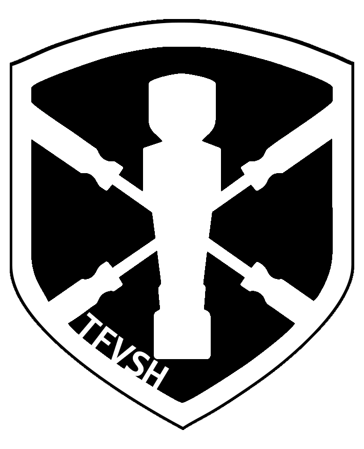

    

        
        Spielordnung des TFVSH
    

    

        Zuletzt geändert am:  {{ site.time | date: "%d-%m-%Y" }}
    

    

        <a href="./../assets/pdf/spielordnung.pdf" target="_blank">Download als PDF</a> 
        <a href="https://github.com/TFVSH/tfvsh-docs/blob/main/docs/spielordnung.md" target="_blank">GitHub Repository</a>
    

* TOC
  {:toc}

# Spielordnung des Tischfußballverbands Schleswig-Holstein (TFVSH)

## 1. Allgemeines

_(Dieser Punkt wurde zur Vorgängerversion neu Strukturiert und der Inhalt nicht geändert)_

1. Der Spielbetrieb wird durch folgende Spielordnung für alle Tischfußballverband
   Schleswig-Holstein e.V. eigene Veranstaltungen geregelt.
2. Begrifflichkeiten:
    - Der "Tischfußballverband Schleswig-Holstein e.V." wird nachstehend TFVSH genannt.
    - Der "Deutscher Tischfußballbund e.V.", auch "DTFB e.V.", wird nachstehend DTFB genannt.
    - Die "International Table Soccer Federation", wird nachstehend ITSF genannt.
    - "Schleswig-Holstein" wird nachstehend SH genannt.
    - Als Veranstalter der offiziellen Wettbewerbe wie “Landesliga Schleswig-Holstein”,
      “Landespokal Schleswig-Holstein“, “Landesmeisterschaft Schleswig-Holstein” gilt der TFVSH.
    - Der Begriff "Spieler" ist in dieser Spielordnung ohne Wertung geschlechtlich
      neutral verwendet. Es sind damit sowohl weibliche als auch männliche Spieler gemeint.
    - „Startkategorie“ bezieht sich auf Damen, Herren, Junioren und Senioren Einzel/Dopppel.
3. Die Teilnahme an sportlichen Veranstaltungen des TFVSH ist in der Spielordnung
   oder der jeweiligen Ausschreibung geregelt.
4. Die zugelassenen Spielgeräte bei TFVSH Veranstaltungen sind in der Spielordnung
   oder der jeweiligen Ausschreibung geregelt.
5. Die Gesamtleitung des Spielbetriebes des Verbandes obliegt dem Vorstand des
   TFVSH. Sobald ein Sportwart im TFVSH gewählt oder berufen wird, obliegt die
   Gesamtleitung des Spielbetriebes dem Sportwart des TFVSH.

## 2. Sonderregeln wegen noch geringer Teilnehmerzahlen

1. Im bislang bzgl. Tischfußball strukturschwachen Bundesland Schleswig-Holstein, ist
   noch nicht jede Spielergemeinschaft (z. B. für die Landesliga) in der rechtlichen Form des
   Vereins organisiert, obwohl dies angestrebt wird. An Stellen, wo explizit dazwischen
   unterschieden werden soll, werden folgend die vereinslosen Spielergemeinschaften
   "Spielgemeinschaften" und die Vereine eben "Verein" genannt. Der Begriff "Mannschaft"
   soll übergreifend für antretende Teams gelten, die aus beiden Formen hervorgehen können.
2. Bei sportlichen Veranstaltungen des TFVSH soll es auf lange Sicht einzelne Disziplinen
   für Herren, Damen, Junioren und Senioren geben. Bei geringer Zahl der Anmeldungen in
   den jeweiligen Disziplinen können Disziplinen zusammengelegt
   werden, so dass z. B. Herren und Damen zusammen in derselben Disziplin antreten. Die
   jeweilige Entscheidung dazu obliegt der Turnierleitung.
3. Für die Landesliga SH gilt derzeit eine Doppelspielberechtigung bzgl. der Landesliga
   des TFVHH, die mit der dortigen Ligaleitung vereinbart ist. Danach ist es Spielern aus SH
   zum jetzigen Stand möglich, zusätzlich an der Landesliga des TFVHH teilzunehmen. Dazu
   gelten dann die Teilnahmebedingungen des TFVHH. Bei der Landesliga dürfen nur
   Verbandsmitglieder des TFVSH mitspielen. Dies ist also eine explizite Sonderregel im
   Einvernehmen der beiden Landesverbände zur Anfangsförderung des TFVSH. Diese
   Sonderregel wird jede Saison neu überprüft und verhandelt. Spieler können grundsätzlich
   keinen Anspruch daraus geltend machen.
    1. Spieler mit Wohnsitz in SH können über Spielgemeinschaften Verbandsmitglied
       werden.
    2. Spieler mit Wohnsitz außerhalb SH können nur über einen in SH ansässigen Verein
       Verbandsmitglied werden.

## 3. Spielberechtigung

1. Spielberechtigt ist, wer beim TFVSH gemeldet ist und die Mitgliedsgebühren für das
   laufende Kalenderjahr entrichtet wurden.

## 4. Erforderliche Dinge für die Anmeldung eines Spielers beim Verband

1. Vor- und Nachname, Geschlecht, Geburtsdatum und eine E-Mail-Adresse.
2. Der Saisonbeitrag muss auf dem Konto des TFVSH eingegangen sein, eine eindeutige
   Zuordnung zum Spieler muss möglich sein. Alternativ kann dem TFVSH eine
   Einzugsermächtigung erteilt werden.
3. Ein ordentliches digitales Porträtfoto des Spielers.
4. Mit der Anmeldung beim TFVSH bekommt das Mitglied die Spielordnung und Satzung
   innerhalb einer Woche zugesandt.
5. Ein Mitglied stimmt zu, dass seine angegebenen Daten an den DTFB übertragen
   werden dürfen um es zu melden. Des Weiteren stimmt es zu, dass Bilder die während einer
   TFVSH-Veranstaltung entstehen und das Mitglied zeigen, für Eigenwerbung des TFVSH
   und dessen Veranstaltungen genutzt werden dürfen. Ist das Mitglied nicht damit
   einverstanden so kann es 14 Tage nach Eingang der Informationen aus 4. iv seine
   Mitgliedschaft widerrufen und bekommt seinen Beitrag zurückerstattet.

## 5. Gültigkeitsdauer

1. Die Saison des DTFB und damit auch des TFVSH entspricht dem Kalenderjahr.
2. Die Gültigkeitsdauer einer Meldung gilt für die Dauer der Saison, für die die Meldung
   stattgefunden hat.
3. Die Gültigkeitsdauer der DTFB- und ITSF-Spielernummern ist identisch mit der
   Gültigkeitsdauer der Meldung. Organisatorisch bleibt die Spielernummer der Person
   zugeordnet, aber es erlischt ihre Gültigkeit und dadurch auch die damit verbundenen
   Spielberechtigung.
4. Eine automatische Verlängerung der Meldung in die folgende Saison findet nicht statt.

## 6. Rückmeldung zur Verlängerung

1. Es handelt sich auch um eine Rückmeldung, wenn der Spieler vorher in einem anderen
   Landesverband gemeldet war. Die Zuordnung der DTFB Spielernummer bleibt trotz
   Wechsel erhalten.
2. Zur Rückmeldung sind alle in Abschnitt 3. iii genannten Dinge notwendig, es sei denn,
   die Daten haben sich nicht verändert und liegen dem TFVSH schon vor.
3. Änderungen der notwendigen Daten sind dem TFVSH bekanntzugeben.
4. Der Saisonbeitrag muss auf dem Konto des TFVSH eingegangen sein oder per
   Barzahlung an ein Mitglied des Präsidiums des TFVSH oder einer bevollmächtigten Person
   durch den TFVSH bezahlt werden.

## 7. Organisation des Spielbetriebes

1. Es gelten bis auf Weiteres die tagesaktuell gültigen Spielregeln des ITSF.
2. Nur in den Punkten, in denen in dieser Spielordnung ausdrücklich davon abgewichen
   wird, hat diese Spielordnung Vorrang.

## 8. Landesliga Schleswig-Holstein

Die Landesliga wird in der Landesliga-Ordnung des TFVSH geregelt.

## 9. Landesmeisterschaft Schleswig-Holstein

1. Ehrung der Sieger und Qualifikation zur Deutschen Meisterschaft
    1. Der TFVSH richtet einmal in jeder Saison Einzel- und Doppelmeisterschaften aus, im
       Sinne der Spielordnung des DTFB, die als Qualifikationsturniere für die Deutschen Einzelund
       Doppelmeisterschaften (für Damen und Herren, Juniorinnen und Junioren, Seniorinnen
       und Senioren) gelten.
    2. Die genauen Regeln zur Qualifikation können in den Statuten des DTFB nachgelesen
       werden.
    3. Der Sieger der Einzelmeisterschaft trägt den Titel „Schleswig-Holsteinischer
       Einzelmeister“ (des jeweiligen Jahres, der jeweiligen Startkategorie), der Sieger der
       Doppelmeisterschaft trägt den Titel „Schleswig-Holsteinischer Doppelmeister“ (des
       jeweiligen Jahres, der jeweiligen Startkategorie).
    4. Die Sieger aller durchgeführten Startkategorien werden in die "Hall of Fame" des DTFB
       eingetragen.
2. Berechtigung zur Teilnahme
    1. Es sind nur Spieler startberechtigt, die dem TFVSH angehören und ihren Wohnsitz
       in SH haben.
    2. Der Mitgliedsbeitritt zum TFVSH kann vor Ort bei der Turnierleitung erfolgen. Jeder hat
       selber dafür Sorge zu tragen, die Aufnahmemodalitäten vorher zu klären und
       entsprechende Voraussetzungen wie z. B. den Mitgliedsbeitrag mitzubringen.
3. Spielmodus
    1. Welche Startkategorien tatsächlich stattfinden und welche in eine Gemeinsame
       zusammengelegt werden, entscheidet die TFVSH Turnierleitung entsprechend der Anzahl
       angemeldeter Spieler der entsprechenden Kategorien.
    2. Der Modus wird soweit wie möglich und sinnvoll an den der Deutschen
       Meisterschaft des DTFB angeglichen.
    3. Die TFVSH Turnierleitung entscheidet auf Grund der Anmeldezahlen und
       organisatorischen Umstände jedes Jahr aufs Neue über den genauen Modus.
    4. Der entschiedene Modus wird in der jeweiligen Ausschreibung bekanntgegeben.
    5. Der Modus kann von der Turnierleitung während der Veranstaltung aus Zeitgründen
       angepasst werden.
    6. Sportbekleidung ist während der Teilnahme an der Landesmeisterschaft Pflicht.

## 10. Landesrangliste

1. Zu den TFVSH-Ranglistenturnieren zählen alle vom TFVSH ausgerichteten Ranglistenturniere:
    1. Mini-Challenger-Turniere
    2. Challenger-Turniere (DTFB),
    3. Pro-Tour-Turniere (ITSF)
    4. Master-Series-Turniere (ITSF)
2. Jeder Mitgliedsverein des TFVSH kann sich um die Austragung solcher Turniere
   bewerben. Der TFVSH-Vorstand entscheidet über die Vergabe.
3. TFVSH-Ranglistenturniere dürfen nur auf offiziellen TFVSH-Spieltischen
   ausgetragen werden. Für DTFB- und ITSF-Turniere dürfen Tische nach deren Vorgabe
   genutzt werden.
4. Der Ausrichter hat dafür sorge zu tragen, dass die Spieltische während des Turniers
   durchgehend für den Spiel- und Trainingsbetrieb münzeinwurffrei sind.
5. Die Ergebnisse sind spätestens am nächsten Tag nach Turnierende an den TFVSH
   zu melden bzw. über die Webseite des TFVSH (www.tfvsh.de) online einzupflegen. Für die
   Ausrichtung ist die „TIFU-Software“, “Kickertool” oder alle vom DTFB zugelassenen
   Turniersoftwareprogramme in der aktuellen Version zu benutzen, da sie fortlaufende
   Platzierungen berechnet und mit einem Datenimport auf der TFVSH-Webseite kompatibel
   ist. Sie wird dem TFVSH kostenfrei vom DTFB zur Verfügung gestellt, der diese an
   Mitgliedsvereine weiter geben darf.
6. Die besten 10 Turnier Ergebnisse jedes Ranglistenturnierspielers ergeben die
   Platzierung.
7. Das jeweilige Ranglistenturnier muss mindestens 7 Tage vor Beginn auf www.tfvsh.de
   unter Termine angekündigt werden. Regeltermine müssen nur einmalig angekündigt
   werden, wobei bei ausfallen eines Termins mindestens 3 Tage vor Turnierstart auf www.
   Tfvsh.de das Ausfallen bekannt gegeben werden muss.
8. Ranglisten-Turniere können als Einzel- und/oder Doppelturnier ausgetragen werden.
   Die erreichten Punkte werden wie folgt gewichtet:
    - Mini-Challenger 50%
    - Mini-Challenger : Dyp ohne K.O. Runde 25%
    - Challenger 100%

## 11. Challenger

1. Der TFVSH richtet Challenger in der vom DTFB geregelten Form aus.
2. Die Ergebnisse werden an den DTFB übermittelt, der sie u. a. für die deutsche
   Rangliste verwertet.
3. Details zum Modus der Challenger können in den Statuten des DTFB nachgelesen
   werden.
4. Tischfußballvereine in SH können sich auf die Ausrichtung von Challenger beim
   TFVSH bewerben.

## 12. Betreute Turniere

1. Betreute Turniere sind solche, bei denen der TFVSH nicht selber als Veranstalter
   auftritt, aber Unterstützung anbietet.
2. Eine solche Unterstützung kann z. B. geschehen durch Hilfe bei der Ankündigung, bei
   der Organisation, oder durch das zur Verfügung stellen von Verbandstischen. Ein Beispiel
   für betreute Turniere sind Challenger, die von dem Verband angehörenden Vereinen
   ausgerichtet werden.
3. Stadtmeisterschaften
    1. Stadtmeisterschaften können von Vereinen vor Ort in Absprache mit dem TFVSH
       ausgerichtet werden.
    2. Der TFVSH tritt dabei nur beratend auf, falls dafür Bedarf besteht.
    3. Der TFVSH bietet für die Umsetzung als Unterstützung die Nutzung von
       Verbandstischen an.

## 13. Sonstige Wettbewerbe

1. Darüber hinaus können beliebige weitere Wettbewerbe veranstaltet werden.

## 14. Richtlinien zum Spielbetrieb

1. Saison
    1. Die Saison des TFVSH beginnt am ~~01.12.~~ 01.01. eines jeden Jahres und endet mit
       dem ~~30.11.~~ 31.12. des ~~nächsten~~ selben Jahres.
    2. ~~Die Ranglistenturniersaison beginnt nach der Austragung einer Landesmeisterschaft und
       endet mit der nächsten Landesmeisterschaft.~~
    3. Die Landesmeisterschaft muss einen Monat vor Meldeschluss zur Deutschen
       Meisterschaft abgeschlossen sein. Sofern kein Pflichttermin vom DTFB vorgeschrieben ist.
2. Material
    1. Spieltische  
       Für die vom TFVSH ausgerichteten Veranstaltungen sind als Spieltische zugelassen:
        - DTFB Partnertische
        - ITFS Partnertische (official und recognized)
        - Über Anträge zu anderen Tischtypen kann der Landesverband TFVSH, im Sinne der
          Förderung des Sports in der strukturschwachen Tischfußballregion Schleswig-Holstein, frei
          entscheiden. Dafür wird ein beratendes aber nicht bindendes Stimmungsbild der Mitglieder
          des Verbandes eingeholt.
    2. Spielbälle
        - Auf den Tischen wird der für den jeweiligen Tischtyp vorgesehene offizielle ITSF-Ball
          gespielt. Bzw. bei nicht ITSF Tischen der vom Hersteller des Tisches für den Turnierbetrieb
          vorgesehene Ball.
        - Die eingesetzten Bälle haben in einem neuwertigen Zustand zu sein.
    3. Originalkomponenten
        - Die Spieltische müssen mit Originalkomponenten bestückt sein.
    4. Schmiermittel
        - Der Eigentümer des Spieltisches trifft die Entscheidung ob Silikonöl oder Pronto als
          Schmiermittel zum Einsatz kommen soll.
        - Auf Wunsch der Gastmannschaft muss die Heimmannschaft das entsprechende
          Schmiermittel zur Verfügung stellen.
    5. Unerlaubte Hilfsmittel
        - Der Einsatz von Zusatzstoffen auf der Spielfläche oder den Bällen ist nur nach vorheriger
          Absprache mit der Turnierleitung erlaubt.
        - Der Gebrauch von Magnesium, Zinkoxid oder ähnlichen Hilfsmitteln ist verboten.

## 15. Änderungen der Spielordnung

1. Anträge auf Änderungen der Spielordnung sind beim TFVSH-Vorstand schriftlich
   einzureichen. Sie sind vom Vorstand in der Mitgliederversammlung vorzutragen.
2. Die Mitgliederversammlung kann Änderungen der Spielordnung mit einfacher
   Mehrheit der anwesenden stimmberechtigten Delegierten beschließen.
3. Kurzfristig notwendige Änderungen der Spielordnung sind jederzeit durch den
   Vorstand möglich.

## 16. Inkrafttreten

1. Diese Spielordnung tritt mit sofortiger Wirkung in Kraft. Mit dem gleichen Zeitpunkt
   tritt die bisherige Spielordnung außer Kraft.
2. Änderungen und Ergänzungen sind den Mitgliedern des Tischfußballverbands
   Schleswig-Holstein mitzuteilen und treten zu diesem Zeitpunkt in Kraft.

## 17. Spieler einer Delegation

Wenn eine Delegation oder einzelne Spieler vom TFVSH entsandt, um bei einem
Wettbewerb (Deutsche Meisterschaft, Länderpokal oder vergleichbarem) anzutreten, dürfen
keine TFVSH-fremden Trikots getragen werden. TFVSH-fremde Trikots sind alle die nicht
zu Vereinen des TFVSH oder TFVSH selbst angehören.
Ein Verstoß kann vom Vorstand mit einem Ausschluss vom nächsten Wettbewerb geahndet
werden.

## 18. Qualifikation zur Deutschen Meisterschaft

1. Die Regeln zur Qualifikation sind dem DTFB zu entnehmen:  
   [https://dtfb.de/index.php/deutsche-meisterschaft/qualifikationsregeln](https://dtfb.de/index.php/deutsche-meisterschaft/qualifikationsregeln)
2. Teilnahmekriterien des Landesverbandes:
    1. Ein Partner seiner Wahl muss mindestens 5 Ranglistenturniere im Qualifikationszeitraum
       beim TFVSH gespielt haben.
3. Qualifikationskette inkl. Nachrückverfahren in absteigender Reihenfolge zu beachten
    1. ITFS Rangliste
    2. DTFB Rangliste
    3. (Sieger Einzel LM &#124; Landesranglistenerster) + Partner seiner Wahl
    4. Sieger Doppel LM.
        1. Wenn einer aus dem Siegerdoppel nicht zur DM fährt darf der Verbleibende Sieger
           mit seinem Partner seiner Wahl fahren
    5. Nachrücker über die Landesrangliste
        1. Sobald ein Spieler seinen Startplatz nicht annimmt wird über die Landesrangliste
           nachgerückt. Es gibt kein Nachrücken über die Tabelle der Landesmeisterschaft mehr.

